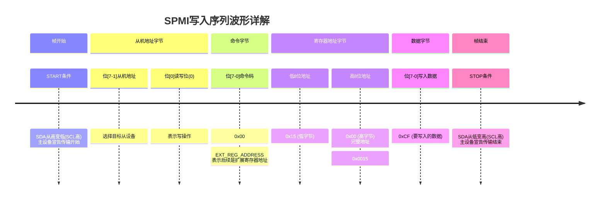

[泰克关于调试SPMI总线的应用笔记](https://download.tek.com/document/Debugging-SPMI_App-Note_48W-61436-0_02.pdf)
好的，我们以泰克这份关于调试SPMI总线的应用笔记为基础，选择一个典型的SPMI波形进行详细解释。

这份应用笔记的第5页有一个非常经典的SPMI总线时序图，我们以这个波形为例来分解说明。SPMI是一个基于两线（时钟和数据）、主从结构的串行总线协议，主要用于手机等移动设备中电源管理IC和应用处理器之间的通信。

为了更直观地理解，我们先来描述一个典型的**写入寄存器**的通信过程，然后对应到波形上的每一个部分。

### 典型SPMI写入序列波形分解

一个完整的SPMI数据帧通常包含以下几个部分：

1.  **START 条件**
2.  **SSB - Slave Address Byte** （从机地址字节）
3.  **Command Byte** （命令字节）
4.  **Register Address Bytes** （寄存器地址字节，1个或多个）
5.  **Data Bytes** （数据字节，0个或多个）
6.  **STOP 条件**

现在，我们对照这些部分来看波形上的每一个“波峰”（实际上是一个个比特位）：

*(这是一个简化的示意图，用于辅助说明)*

---

### 解释每一个“波峰”在做什么

我们将整个通信过程按时间顺序分解：

**1. START 条件**
*   **波形表现**： 当时钟线处于高电平时，数据线从一个高电平**拉低**。
*   **作用**： 这是一个唯一的、特殊的信号，用来通知总线上所有的从设备：“注意，主设备即将开始一次新的通信”。所有从机都会从这个时刻开始准备接收数据。

**2. SSB - 从机地址字节**
*   **波形表现**： START条件之后，时钟开始出现，数据线上会连续出现8个“波峰”（比特位）。这8个比特位构成了一个字节。
*   **作用**： 这个字节用来**选择要和哪个从设备通信**。它通常包含：
    *   **Bit 7:4 (4位)**： 从设备的唯一地址码。
    *   **Bit 3:1 (3位)**： 命令的扩展，在某些情况下使用。
    *   **Bit 0 (1位)**： **读写位**。`0` 表示主设备要**写入**数据到从设备；`1` 表示主设备要**读取**从设备的数据。
*   **在这个例子中**： 如果Bit 0是`0`，表示这是一个**写操作**。

**3. Command Byte - 命令字节**
*   **波形表现**： 在SSB之后，时钟继续，数据线上又出现8个比特位。
*   **作用**： 这个字节告诉被选中的从设备**要执行什么操作**。例如，是写入单个寄存器、写入多个寄存器、读取单个寄存器，还是某种扩展命令等。它定义了后续数据传输的格式。

**4. Register Address Bytes - 寄存器地址字节**
*   **波形表现**： 在命令字节之后，时钟继续，数据线上出现一个或多个字节（8位一组）。
*   **作用**： 这些“波峰”组成了一个地址值，告诉从设备：“我要读写的是你内部的哪个寄存器”。地址的长度（1字节、2字节等）由之前的命令码决定。

**5. Data Bytes - 数据字节**
*   **波形表现**： 在寄存器地址之后，时钟继续，数据线上出现一个或多个字节。
*   **作用**： 这些“波峰”就是实际要传输的数据内容。对于写操作，这是主设备要写入从设备寄存器的值；对于读操作，这个阶段会是空的，数据会在后续的读操作帧中由从设备发出。

**6. STOP 条件**
*   **波形表现**： 当时钟线处于高电平时，数据线从低电平**释放回高电平**。
*   **作用**： 这标志着本次通信的**结束**。总线恢复到空闲状态，等待下一次START条件。

---

### 回答你的两个关键问题

**1. Clock为什么不是一直有？**

*   **核心原因：SPMI总线是按需通信的。**
    SPMI总线设计的目的之一就是**节能**。在移动设备中，功耗是至关重要的考量。如果时钟一直运行，即使没有数据传输，总线上的电路也会持续消耗电能。
*   **工作原理**：
    *   总线在大部分时间处于**空闲状态**，此时时钟线和数据线都通过上拉电阻保持在高电平，功耗极低。
    *   只有当主设备（如应用处理器）需要与从设备（如电源管理芯片）通信时，它才会产生时钟信号，启动一次数据传输。
    *   传输结束后，时钟立即停止。这种“非持续”的工作方式极大地降低了平均功耗。

**2. 为什么Clock中间会中断？**

你观察到的Clock中间中断，通常指的是在一个完整的数据帧传输过程中，时钟并不是一个连续的脉冲串，而是可能会在字节与字节之间出现短暂的停顿。这主要是由于以下两个原因：

*   **原因A：时钟由从设备控制（Clock Stretching）**
    *   SPMI协议允许从设备在需要更多时间来处理数据时，**主动将时钟线拉低并保持**。
    *   **为什么需要这样做？** 想象一下主设备发送了一个读取命令，从设备需要时间去自己的寄存器里取出数据。如果从设备速度较慢，它就会通过拉低时钟线来告诉主设备：“请等一下，我还没准备好下一个字节”。主设备检测到时钟线被拉低后，会**暂停发送下一个时钟脉冲**，并等待从设备释放时钟线。
    *   **波形表现**： 你在时钟序列中看到的某个低电平脉冲被异常拉长的现象，就是“时钟拉伸”。这是完全正常的、由协议支持的流程。

*   **原因B：主设备的处理时间**
    *   即使是主设备自己，在准备下一个要发送的字节时（例如，计算下一个寄存器地址或数据），其软件或硬件也可能需要一些时间。在这种情况下，主设备的控制器可能会在发送完一个字节后，**暂时停止产生时钟**，直到它准备好发送下一个字节为止。这也会在时钟序列中造成一个间隙。

### 总结

*   **每一个“波峰”**： 都是串行数据流中的一个比特，它们被精心组织成“地址”、“命令”、“数据”等有意义的包，以完成主从设备间的精准通信。
*   **Clock不一直有**： 是为了在通信间歇期**节省功耗**，这是SPMI总线为移动设备设计的关键特性。
*   **Clock中间中断**： 通常是**正常的流程控制机制**，特别是“时钟拉伸”，它确保了不同速度的设备可以在同一总线上协同工作，防止了数据丢失。

通过这样的分解，你就可以像阅读一本书一样，读懂SPMI总线波形上的每一个细节，从而有效地进行硬件调试。

好的，我们严格以泰克应用笔记 **第5页** 的波形图为例，进行逐一的、详细的解释。该页的波形图展示了一个典型的 **SPMI 写入序列**。

下图清晰地还原了该波形图的结构，我们将按照图中的编号进行逐步解析：

---

### 对每个SDA波峰的详细解释

现在，我们根据上面的流程图，对每个部分的具体比特位进行解读：

**1. START 条件**
*   **描述**： 在时钟处于高电平期间，数据线产生一个从高到低的下降沿。
*   **作用**： 这是帧开始的唯一标志。总线上的所有从机都会检测到这个信号，并准备接收后续的地址字节。

**2. 从机地址字节 - 比特位 [7:1]**
*   **描述**： 在第一个到第七个时钟脉冲期间，数据线上传输的7个比特。
*   **作用**： 这7个比特构成了**从机地址**，用于选择总线上众多从设备中的某一个。只有地址匹配的从机才会响应后续的命令。

**3. 从机地址字节 - 比特位 [0] (读写位)**
*   **描述**： 在第八个时钟脉冲期间，数据线上传输的1个比特。
*   **作用**： 这是一个**控制位**，指明本次传输是读操作还是写操作。
    *   **在此波形中，该位为 '0'**，表示这是一个**写操作**。主设备将要向从设备写入数据。

**4. 命令字节 - 比特位 [7:0]**
*   **描述**： 在第九到第十六个时钟脉冲期间，数据线上传输的8个比特。
*   **作用**： 这个字节告诉被选中的从设备，要执行的具体操作类型。根据文档注释，此处的命令码是 **`0x00`**，它对应 **`EXT_REG_ADDRESS`** 命令。这个命令的含义是：主设备将要进行一次扩展寄存器地址的写入操作，并且**后续会跟两个字节的寄存器地址**。

**5. 寄存器地址低字节 - 比特位 [7:0]**
*   **描述**： 在第十七到第二十四个时钟脉冲期间，数据线上传输的8个比特。
*   **作用**： 这是**寄存器地址的第一个字节**。根据波形图下的注释，该字节值为 **`0x15`**。由于地址有两个字节，这是**低字节**。

**6. 寄存器地址高字节 - 比特位 [7:0]**
*   **描述**： 在第二十五到第三十二个时钟脉冲期间，数据线上传输的8个比特。
*   **作用**： 这是**寄存器地址的第二个字节**。根据注释，该字节值为 **`0x00`**。这是**高字节**。结合上一个字节，完整的目标寄存器地址就是 **`0x0015`**。

**7. 数据字节 - 比特位 [7:0]**
*   **描述**： 在第三十三到第四十个时钟脉冲期间，数据线上传输的8个比特。
*   **作用**： 这是**要写入目标寄存器的实际数据**。根据注释，该数据值为 **`0xCF`**。这意味着主设备希望将十六进制值 `CF` 写入到从设备的 `0x0015` 寄存器中。

**8. STOP 条件**
*   **描述**： 在最后一个数据位传输完毕，且时钟线为高电平期间，数据线产生一个从低到高的上升沿。
*   **作用**： 这是一个唯一的信号，标志着**整个帧的结束**。总线进入空闲状态，数据线和时钟线均由上拉电阻拉至高电平。

---

### 关于时钟的中断

在这个特定的波形图中，时钟在字节之间是连续的，没有显示出明显的“时钟拉伸”。但是，回答你关于时钟为什么会中断的问题，对于理解SPMI至关重要：

*   **根本原因：时钟由主设备产生，但可由从设备控制。**
*   **时钟拉伸：** SPMI协议允许从设备在需要更多时间来处理数据时，通过将时钟线拉低并保持来**暂停通信**。主设备会一直等待，直到从设备释放时钟线。
    *   **例如**：在从机地址字节之后，从设备可能需要一点时间来确认地址。或者在主设备读取数据时，从设备可能需要时间来准备数据。在这些情况下，你都可能在波形上看到时钟线在字节之间被拉低一段较长的时间，导致时钟脉冲序列“中断”。
*   **节能**： 时钟只在数据传输时存在。一次传输结束后，时钟会完全停止，直到下一次传输开始，这极大地节省了功耗。

**总结**：第5页的波形展示了一个完整的SPMI扩展寄存器写入过程。每一个SDA上的“波峰”（比特位）都是这个有序指令和数据包的一部分，从宣告开始、选择设备、发出命令、指定地址，到最后交付数据并宣告结束。